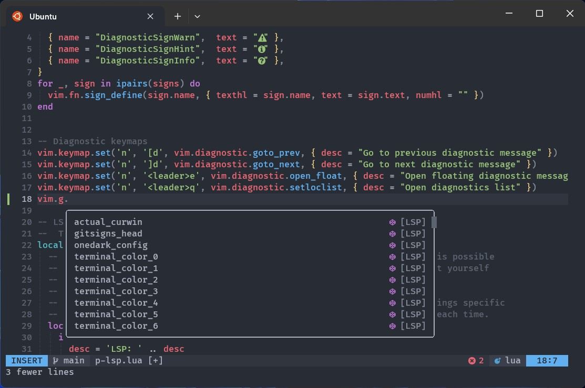

## Installation

Run this command to install this Neovim configuration into your machine

```sh
curl -sL https://raw.githubusercontent.com/arisnacg/neovim/main/install.sh | sh
```

Don't worry if you already have your own configuration, your `.config/nvim` folder is renamed to `.config/nivm.backup`. Enjoy!! 😁
